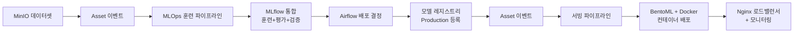

# 버전
- 파이썬: 3.12(airflow가 3.12를 지원)


# 로컬 설치

## 기초 세팅

```bash
# uv 세팅
uv init
uv venv

# 파이썬 세팅
uv python list
uv python install cpython-3.12.11-linux-x86_64-gnu
uv python pin 3.12
uv sync
```

## vscode extension 설치
airflow - necati arslan


# Airflow Executors

## Executor 종류

### 1. SequentialExecutor (기본값 - standalone 모드)
- **단일 프로세스**, 순차 실행
- 개발/테스트용으로만 사용
- 병렬 처리 불가능

### 2. LocalExecutor
- **단일 머신**, 멀티프로세스
- 병렬 태스크 실행 가능
- CPU 코어 수만큼 워커 프로세스 생성
- 현재 프로젝트 설정

**주요 설정:**
- `AIRFLOW__CORE__PARALLELISM=32`: 전체 동시 태스크 수
- `AIRFLOW__CORE__DAG_CONCURRENCY=16`: DAG당 동시 태스크 수

### 3. CeleryExecutor
- **다중 머신** 분산 처리
- Redis/RabbitMQ 메시지 브로커 필요
- 여러 서버에서 워커 실행 가능
- 진정한 분산 처리

### 4. KubernetesExecutor
- 각 태스크를 별도 Kubernetes Pod에서 실행
- 동적 리소스 할당
- 클라우드 환경에 최적

## 현재 설정

```yaml
# LocalExecutor 사용
environment:
  - AIRFLOW__CORE__EXECUTOR=LocalExecutor
  - AIRFLOW__CORE__PARALLELISM=32
  - AIRFLOW__CORE__DAG_CONCURRENCY=16

# 모든 컴포넌트 실행
command: >
  bash -c "
    airflow db migrate &&
    airflow scheduler &
    airflow triggerer &
    airflow api-server
  "
```

## Airflow 컴포넌트

- **Scheduler**: DAG 파싱, 태스크 스케줄링
- **API Server**: 웹 UI 및 REST API 제공 (구 webserver)
- **Triggerer**: Deferrable 태스크 처리 (비동기 이벤트 대기)
- **Executor**: 태스크 실행 방식 결정 (Scheduler 내부 컴포넌트)

# 커스텀 이미지 생성
추가적인 플로그인이나 provider, 라이브러리 추가
```dockerfile
FROM apache/airflow:3.0.5-python3.12
USER root
RUN apt-get update \
  && apt-get install -y --no-install-recommends \
         vim \
  && apt-get autoremove -yqq --purge \
  && apt-get clean \
  && rm -rf /var/lib/apt/lists/*


# 
# RUN pip install --no-cache-dir \
#     "apache-airflow==${AIRFLOW_VERSION}" \
#     apache-airflow-providers-apache-spark==5.1.1


USER airflow

```

# 개발 환경 설정

## 프로젝트 개요

Apache Airflow 실습 프로젝트 (Python 3.13+). `uv`를 패키지 매니저로 사용합니다.

## 개발 설정

- `uv`를 의존성 관리 도구로 사용
- Python 버전: >=3.13 (pyproject.toml에 명시)
- 메인 진입점: `main.py`

## 주요 명령어

### 패키지 관리
- 의존성 설치: `uv sync`
- 새 의존성 추가: `uv add <package>`
- Python 스크립트 실행: `uv run python main.py`

### Docker
- 서비스 시작: `docker-compose up`
- 백그라운드 시작: `docker-compose up -d`
- 서비스 중지: `docker-compose down`

## 아키텍처

현재 최소한의 Python 프로젝트로 구성:
- `main.py`의 단일 진입점
- 컨테이너화된 개발을 위한 Docker Compose 설정
- pyproject.toml을 사용한 표준 Python 프로젝트 구조

이 프로젝트는 Airflow 실험과 학습을 위한 초기 설정 단계입니다.

# Airflow DAG 스케줄링

## Schedule 파라미터 설정 방법

### 1. timedelta 방식 (현재 사용 중)
```python
from datetime import timedelta

schedule=timedelta(days=1)      # 매일
schedule=timedelta(hours=6)     # 6시간마다  
schedule=timedelta(minutes=30)  # 30분마다
schedule=timedelta(weeks=1)     # 매주
```

### 2. Cron 표현식 (가장 유연함)
```python
schedule="0 2 * * *"        # 매일 오전 2시
schedule="30 14 * * 1-5"    # 평일 오후 2:30
schedule="0 9 1 * *"        # 매월 1일 오전 9시
schedule="0 0 * * 0"        # 매주 일요일 자정
```

### 3. 사전 정의된 상수
```python
from airflow.timetables.trigger import CronTriggerTimetable

schedule="@daily"       # 매일 자정
schedule="@hourly"      # 매시간
schedule="@weekly"      # 매주 일요일 자정  
schedule="@monthly"     # 매월 1일 자정
schedule="@yearly"      # 매년 1월 1일 자정
schedule="@once"        # 한 번만 실행
```

### 4. 수동 실행만
```python
schedule=None           # 수동 트리거만
```

### 5. Dataset 기반 스케줄링 (최신 기능)
```python
from airflow import Dataset

schedule=[Dataset("s3://bucket/data")]  # 데이터셋 업데이트 시 실행
```

**추천:** 정확한 시간이 중요하면 cron, 간격이 중요하면 timedelta를 사용하세요.

# MLOps 아키텍처: MLflow vs Airflow 역할 정의

## 전체 MLOps 파이프라인 아키�ecture

```
┌─────────────────┐    ┌──────────────────┐    ┌─────────────────┐
│   Data Sources  │    │    Airflow       │    │     MLflow      │
│   (MinIO/S3)    │───▶│  (Orchestrator)  │◄──▶│ (ML Lifecycle)  │
└─────────────────┘    └──────────────────┘    └─────────────────┘
                              │                        │
                              ▼                        ▼
┌─────────────────┐    ┌──────────────────┐    ┌─────────────────┐
│   Monitoring    │◄───│   Production     │    │  Model Registry │
│   (Alerts)      │    │   Deployment     │    │   (Staging)     │
└─────────────────┘    └──────────────────┘    └─────────────────┘
```

## 역할 분담 상세 정의

### 🚀 Airflow 담당 영역 (워크플로우 오케스트레이션)

#### 1. **데이터 파이프라인 전체 관리**
```python
@task
def extract_from_minio():
    # MinIO/S3에서 데이터 추출
    
@task  
def validate_data_quality():
    # 데이터 품질 검증
    
@task
def trigger_preprocessing():
    # 전처리 파이프라인 실행
```

#### 2. **ML 파이프라인 오케스트레이션**
```python
@task
def trigger_mlflow_experiment():
    # MLflow 실험 시작 트리거
    subprocess.run(["mlflow", "run", ".", "-P", "dataset=iris"])
    
@task
def validate_model_performance():
    # 모델 성능 임계값 검증
    if accuracy < 0.8:
        raise AirflowException("성능 부족")
        
@task
def deploy_to_production():
    # 프로덕션 배포 실행
```

#### 3. **외부 시스템 연동**
- MinIO/S3 파일 감지 및 처리
- Database 연결 및 ETL
- API 호출 및 알림 전송
- Kubernetes/Docker 배포 관리

#### 4. **조건부 워크플로우 제어**
```python
# 성능 기준에 따른 분기 처리
@task.branch
def check_model_performance():
    if model_accuracy >= threshold:
        return "deploy_to_production"
    else:
        return "retrain_with_new_params"
```

#### 5. **스케줄링 및 이벤트 드리븐**
- Asset 기반 스케줄링 (데이터 업데이트 감지)
- 정기적 모델 재훈련 스케줄
- 실시간 데이터 드리프트 감지

### 🧪 MLflow 담당 영역 (ML 실험 및 모델 관리)

#### 1. **실험 추적 (Experiment Tracking)**
```python
import mlflow

with mlflow.start_run():
    mlflow.log_params({"n_estimators": 100, "max_depth": 6})
    mlflow.log_metrics({"accuracy": 0.95, "f1_score": 0.92})
    mlflow.log_artifacts("model_plots/")
```

#### 2. **모델 저장 및 버전 관리**
```python
# 모델 저장
mlflow.sklearn.log_model(model, "model")

# 모델 등록
mlflow.register_model(
    model_uri="runs:/{}/model".format(run_id),
    name="iris_classifier"
)
```

#### 3. **모델 스테이징 관리**
```python
# 모델 스테이지 전환
client = MlflowClient()
client.transition_model_version_stage(
    name="iris_classifier",
    version=3,
    stage="Production"
)
```

#### 4. **재현 가능한 실험 (MLflow Projects)**
```yaml
# MLproject 파일
name: iris_classification
entry_points:
  train:
    parameters:
      alpha: float
      max_depth: int
    command: "python train.py --alpha {alpha} --max-depth {max_depth}"
```

## 실제 워크플로우 예시

### Phase 1: Airflow가 전체 파이프라인 제어
```python
@dag(schedule=[dataset_asset])
def mlops_pipeline():
    # 1. 데이터 준비 (Airflow)
    data_ready = prepare_dataset()
    
    # 2. MLflow 실험 트리거 (Airflow → MLflow)
    experiment = trigger_mlflow_training(data_ready)
    
    # 3. 성능 검증 (Airflow)
    validation = validate_model_metrics(experiment)
    
    # 4. 조건부 배포 (Airflow)
    deployment = deploy_if_good_performance(validation)
```

### Phase 2: MLflow가 ML 세부사항 처리
```python
# train.py (MLflow가 실행)
def train_model(dataset, model_type, hyperparams):
    with mlflow.start_run():
        # 실제 훈련 로직
        model = create_model(model_type, hyperparams)
        model.fit(X_train, y_train)
        
        # 평가 및 로깅
        accuracy = model.score(X_test, y_test)
        mlflow.log_metric("accuracy", accuracy)
        mlflow.sklearn.log_model(model, "model")
```

## 핵심 원칙

### ✅ Airflow가 해야 할 일:
- **워크플로우 오케스트레이션**: 언제, 어떤 순서로 실행할지
- **외부 시스템 연동**: 데이터 소스, API, 배포 시스템
- **조건부 로직**: 성능에 따른 분기, 에러 핸들링
- **스케줄링**: 정기 실행, 이벤트 기반 실행

### ✅ MLflow가 해야 할 일:
- **실험 관리**: 하이퍼파라미터, 메트릭, 아티팩트 추적
- **모델 저장**: 버전 관리, 메타데이터 저장
- **재현성**: 같은 조건에서 같은 결과 보장
- **모델 레지스트리**: 스테이징, 프로덕션 모델 관리

### ❌ 역할 중복 피하기:
- Airflow에서 하이퍼파라미터 튜닝 ❌ (MLflow 담당)
- MLflow에서 복잡한 워크플로우 제어 ❌ (Airflow 담당)
- Airflow에서 모델 메타데이터 저장 ❌ (MLflow 담당)

## 결론

**Airflow**: "언제, 어떻게 실행할지"를 결정하는 **마에스트로**  
**MLflow**: "ML 실험을 어떻게 기록하고 관리할지"를 담당하는 **ML 전문가**

이렇게 역할을 분리하면 각 도구의 장점을 최대화하면서 복잡성을 최소화할 수 있습니다.

# 프로젝트 현재 상태

## 구현된 DAG 목록

### 1. **basic_dag_example.py** 
- **목적**: TaskFlow API 기본 예제
- **스케줄**: 수동 실행
- **기능**: 단순한 Python task 체인 예제

### 2. **etl_example.py**
- **목적**: PostgreSQL ETL 파이프라인 + Asset 활용
- **스케줄**: 매일 자정 실행 (`@daily`)
- **기능**: CSV → PostgreSQL 데이터 적재, Asset-based lineage 추적
- **Asset**: 
  - `csv_data_asset`: 입력 CSV 파일
  - `employee_data_asset`: PostgreSQL 테이블 출력

### 3. **minio_asset_example.py** ⭐️
- **목적**: Asset 기반 이벤트 드리븐 파이프라인
- **구성**: Producer DAG + Consumer DAG + Path Watcher
- **기능**:
  - **Producer**: 매일 MinIO 데이터 업데이트 (`@asset` 데코레이터)
  - **Path Watcher**: 5분마다 새 파일 생성 감지
  - **Consumer**: Asset 변경 감지 시 자동 실행

### 4. **mlops_pipeline_example.py** 🚀
- **목적**: 완전한 MLOps 훈련 파이프라인
- **스케줄**: 수동 실행 (파라미터 기반)
- **지원 데이터셋**: iris, titanic, housing
- **지원 모델**: XGBoost, LightGBM, Scikit-learn
- **핵심 특징**:
  - **동적 파라미터**: 데이터셋/모델 선택 가능
  - **통합 MLflow**: 훈련→평가→검증→등록 일괄 처리
  - **Airflow 의사결정**: 성능 기반 배포 결정
  - **Asset 기반**: 데이터 lineage 추적

### 5. **model_serving_pipeline.py** 🍱
- **목적**: BentoML 기반 모델 서빙 배포
- **스케줄**: Asset 변경 감지 (Production 모델 등록 시)
- **배포 방식**: Docker 컨테이너 (Kubernetes 대신)
- **핵심 특징**:
  - **BentoML 자동화**: OpenAPI, 메트릭, 헬스체크 내장
  - **Docker Compose**: 다중 인스턴스 + Nginx 로드밸런서
  - **완전한 서빙**: 배포→모니터링→헬스체크→알림

## MLOps 아키텍처 전체 플로우



## 기술 스택

### Core Technologies
- **Apache Airflow 3.0.5**: 워크플로우 오케스트레이션
- **Python 3.12**: 개발 언어
- **uv**: 패키지 관리자
- **Docker & Docker Compose**: 컨테이너화

### MLOps Stack
- **MLflow**: 실험 추적, 모델 관리, 레지스트리
- **BentoML**: 모델 서빙 프레임워크
- **MinIO/S3**: 데이터 저장소
- **PostgreSQL**: 데이터베이스 (ETL 예제)

### Deployment & Infrastructure
- **Docker 컨테이너**: 모델 서빙 환경
- **Nginx**: 로드밸런서, 프록시
- **Prometheus**: 메트릭 수집 (BentoML 내장)
- **Asset-based Scheduling**: 이벤트 드리븐 실행

## 주요 구현 패턴

### 1. **Asset 기반 데이터 파이프라인**
- 데이터 변경 감지 → 자동 파이프라인 실행
- 데이터 lineage 추적 및 시각화
- 이벤트 드리븐 아키텍처

### 2. **MLflow + Airflow 통합**
- MLflow: 실험 관리, 모델 추적
- Airflow: 워크플로우 제어, 의사결정
- 명확한 책임 분리

### 3. **BentoML 모델 서빙**
- 자동 API 생성 (OpenAPI/Swagger)
- 내장 모니터링 및 메트릭
- Docker 기반 간편 배포

### 4. **파라미터 기반 동적 실행**
- 런타임 데이터셋/모델 선택
- 하이퍼파라미터 튜닝 지원
- A/B 테스트 준비

## 실행 방법

### 개발 환경 시작
```bash
# 의존성 설치
uv sync

# Airflow 서비스 시작
docker-compose up -d

# 웹 UI 접속
open http://localhost:8080
```

### MLOps 파이프라인 실행
```bash
# 1. 훈련 파이프라인 (수동 트리거 + 파라미터)
# Airflow UI에서 mlops_training_pipeline 실행
# 파라미터: dataset=iris, model_type=xgboost

# 2. 서빙 파이프라인 (자동 트리거)
# 모델이 Production stage로 등록되면 자동 실행

# 3. 서빙 API 테스트
curl -X POST http://localhost:8080/predict \
  -H "Content-Type: application/json" \
  -d '[[5.1, 3.5, 1.4, 0.2]]'
```

## 향후 계획

### Phase 1: 현재 완료 ✅
- [x] 기본 Airflow 환경 구성
- [x] Asset 기반 파이프라인 구현
- [x] MLOps 훈련 파이프라인 구현
- [x] BentoML 서빙 파이프라인 구현

### Phase 2: 확장 계획 🚧
- [ ] 실제 MLflow 서버 연동
- [ ] MinIO 클러스터 구성
- [ ] 모델 A/B 테스트 자동화
- [ ] CI/CD 파이프라인 통합
- [ ] 모니터링 대시보드 (Grafana)

### Phase 3: 프로덕션 준비 🎯
- [ ] Kubernetes 배포 (선택사항)
- [ ] 보안 강화 (인증, 권한)
- [ ] 스케일링 최적화
- [ ] 로깅 및 추적 시스템

이 프로젝트는 **현대적인 MLOps 파이프라인의 완전한 구현체**입니다.

